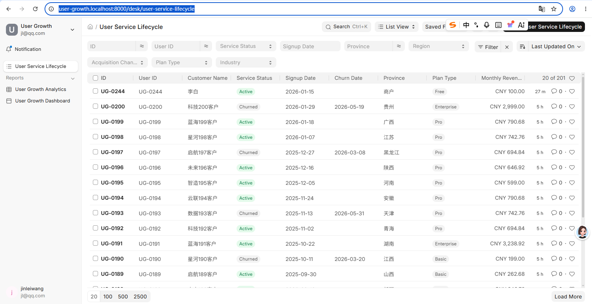
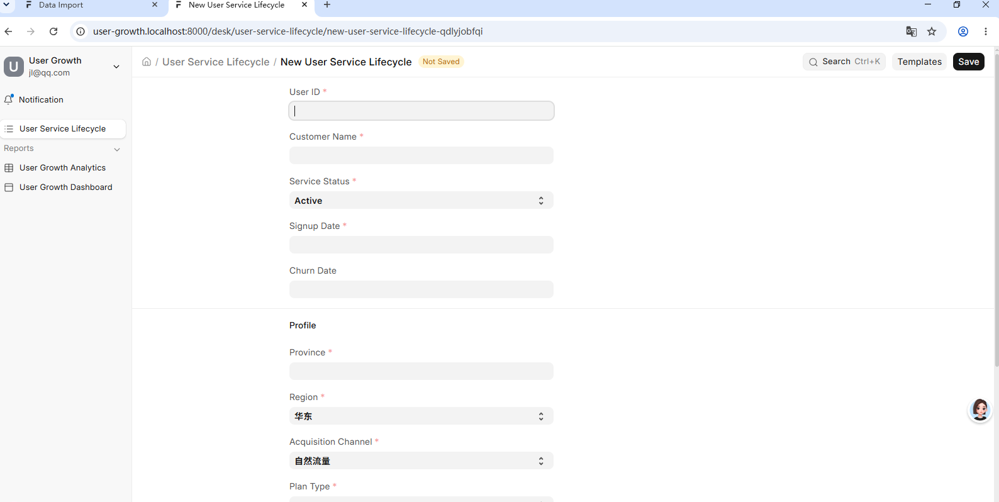
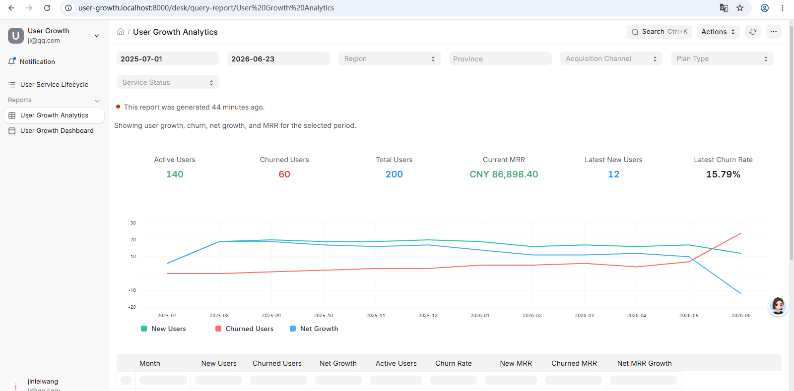
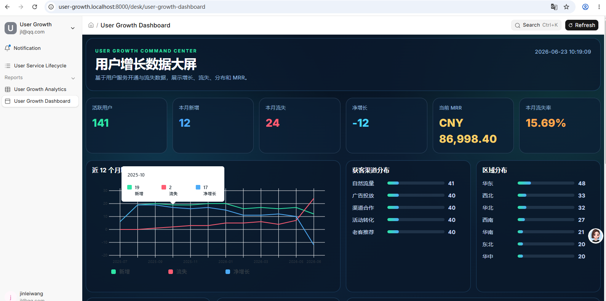

# User Growth

User Growth 是一个基于 Frappe Framework 的用户增长分析示例应用，用于展示用户服务生命周期、用户增长分析报表和用户增长仪表盘。

## 功能概览

本应用本次交付并验证了以下核心页面：

| 功能 | 访问地址 | 说明 |
| --- | --- | --- |
| 用户服务生命周期 | <http://user-growth.localhost:8000/desk/user-service-lifecycle> | 管理和查看用户从服务开通、使用、续费到流失等阶段的生命周期数据。 |
| 新增用户服务生命周期记录 | <http://user-growth.localhost:8000/desk/user-service-lifecycle/new?service_status=Active> | 用户服务生命周期的新增记录页面，用于创建具体生命周期记录。 |
| 用户增长分析报表 | <http://user-growth.localhost:8000/desk/query-report/User%20Growth%20Analytics> | 以 Query Report 形式展示用户增长分析数据，便于按报表维度查看增长指标。 |
| 用户增长仪表盘 | <http://user-growth.localhost:8000/desk/user-growth-dashboard> | 汇总展示用户增长核心指标、趋势和分析结果，作为运营观察入口。 |

更完整的功能说明见仓库根目录文档：[FEATURES.md](FEATURES.md)。

## 功能页面

### 1. 用户服务生命周期

访问地址：<http://user-growth.localhost:8000/desk/user-service-lifecycle>

该页面用于查看和维护用户服务生命周期相关信息，支持在 Frappe Desk 中对用户服务阶段进行跟踪。

测试截图：



### 2. 新增用户服务生命周期记录

访问地址：<http://user-growth.localhost:8000/desk/user-service-lifecycle/new?service_status=Active>

该页面是用户服务生命周期功能的新增记录页面，用于创建具体生命周期记录。也可以在“用户服务生命周期”列表页右上角点击 `+ Add User Service Lifecycle` 进入相同页面。

测试截图：



### 3. 用户增长分析报表

访问地址：<http://user-growth.localhost:8000/desk/query-report/User%20Growth%20Analytics>

该页面是用户增长分析 Query Report，用于查看用户增长相关统计结果。报表适合用于数据核对、运营分析和周期性指标查看。

测试截图：



### 4. 用户增长仪表盘

访问地址：<http://user-growth.localhost:8000/desk/user-growth-dashboard>

该页面是用户增长仪表盘，集中展示用户增长核心数据和分析结果，便于快速了解当前用户增长情况。

测试截图：



## 安装

> 前置条件：本机已经有一个可用的标准 Frappe v16 bench（参考 [bench init 文档](https://github.com/frappe/bench)），并已部署好 MariaDB、Redis 等依赖服务。

使用 [bench](https://github.com/frappe/bench) CLI 安装本应用：

```bash
cd $PATH_TO_YOUR_BENCH

# 1. 拉取本应用源码到 bench 的 apps/ 目录
bench get-app https://github.com/wangjinlei001/user_growth_frappe_app --branch main

# 2. 创建一个新站点（如已存在可跳过）
bench new-site user-growth.localhost \
  --mariadb-root-password <YOUR_MARIADB_ROOT_PASSWORD> \
  --admin-password <YOUR_ADMIN_PASSWORD>

# 3. 在站点上安装本应用
bench --site user-growth.localhost install-app user_growth
```

如果已经在 bench 中获取过应用，且站点已存在，可以直接安装：

```bash
cd $PATH_TO_YOUR_BENCH
bench --site user-growth.localhost install-app user_growth
```

安装过程会自动：

- 创建模块 `User Growth`、DocType `User Service Lifecycle`、Report `User Growth Analytics`、Page `User Growth Dashboard`。
- 通过 `after_install` 写入 200 条用于演示的用户服务生命周期 mock 数据。
- 注册 Desk 工作区 `User Growth`，并把上述三个入口加入工作区侧边栏。
- 在 Desk 应用切换器（`/desk`）和应用启动页上为 `User Growth` 创建独立卡片。

## 安装后访问

启动 bench 服务：

```bash
cd $PATH_TO_YOUR_BENCH
bench start
```

打开 <http://user-growth.localhost:8000>，用管理员账号登录后：

1. 直接打开 <http://user-growth.localhost:8000/desk>，应该能看到 **Framework** 和 **User Growth** 两张应用卡片，点击 `User Growth` 进入工作区。
2. 或者直接访问 <http://user-growth.localhost:8000/app/user-growth>，左侧工作区侧边栏会显示：
   - 用户服务生命周期
   - 用户增长分析报表
   - 用户增长仪表盘

> 如果浏览器无法解析 `user-growth.localhost`，请在 hosts 文件中加入：`127.0.0.1 user-growth.localhost`。

## 本地运行

进入 bench 目录后启动服务：

```bash
cd $PATH_TO_YOUR_BENCH
bench start
```

访问前请确认：

1. bench 服务已启动。
2. 当前站点为 `user-growth.localhost`。
3. 已登录 Frappe Desk。
4. 浏览器可以访问 `http://user-growth.localhost:8000`。

## 静态资源构建

如果前端静态资源更新后出现 CSS/JS 404，可在 bench 目录执行：

```bash
bench build
bench clear-cache
bench clear-website-cache
bench restart
```

## 测试

本次页面测试截图存放在仓库根目录的 `test/` 目录中：

```text
test/User_Growth_Analytics.png
test/new-user-service-lifecycle.png
test/user-growth-dashboard.png
test/user-service-lifecycle.png
```

用户增长仪表盘接口相关测试：

```bash
bench --site user-growth.localhost run-tests --module user_growth.user_growth.page.user_growth_dashboard.test_user_growth_dashboard
```

## Contributing

This app uses `pre-commit` for code formatting and linting. Please [install pre-commit](https://pre-commit.com/#installation) and enable it for this repository:

```bash
pre-commit install
```

Pre-commit is configured to use the following tools for checking and formatting your code:

- ruff
- eslint
- prettier
- pyupgrade

## License

mit
